# Virtual_E-Library

## 📚 Summary
- 2021학년도 1학기 (5학기) 데이터베이스 과목 개인 텀프로젝트
- 가상 온라인 도서관 시스템
- 회원들은 웹을 이용해 직접 도서관의 e-book 도서를 검색, 대출, 예약, 반납 기능 이용 가능

## 🛠 Tech
- Oracle RDBMS, sql
- php
- IDE VSCode

## 📷 Design (UI 설계서)
![[ 프로세스 정의서 ]](./readmeImage/design/ProcessDefinition.png "[ 프로세스 정의서 ]")
![[ 사이트 맵 ]](./readmeImage/design/SiteMap.png "[ 사이트 맵 ]")
![[ 시스템 구조 ]](./readmeImage/design/SystemStructure.png "[ 시스템 구조 ]")
![[ UI 설계서(01) :: 로그인, 메인 ]](./readmeImage/design/UIdesign01.png "[ UI 설계서(01) :: 로그인, 메인 ]")
![[ UI 설계서(02) :: 도서검색, 대출기록 조회 ]](./readmeImage/design/UIdesign02.png "[ UI 설계서(02) :: 도서검색, 대출기록 조회 ]")
![[ UI 설계서(03) :: 예약 관리, 정보 수정 ]](./readmeImage/design/UIdesign03.png "[ UI 설계서(03) :: 예약 관리, 정보 수정 ]")

## 📸 ScreenShot
### 👥 User
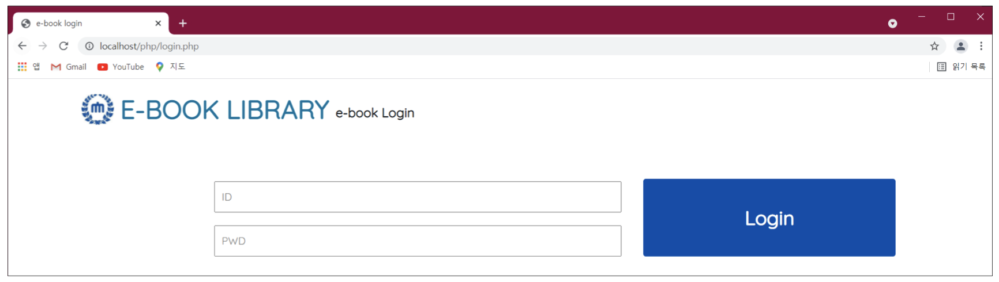
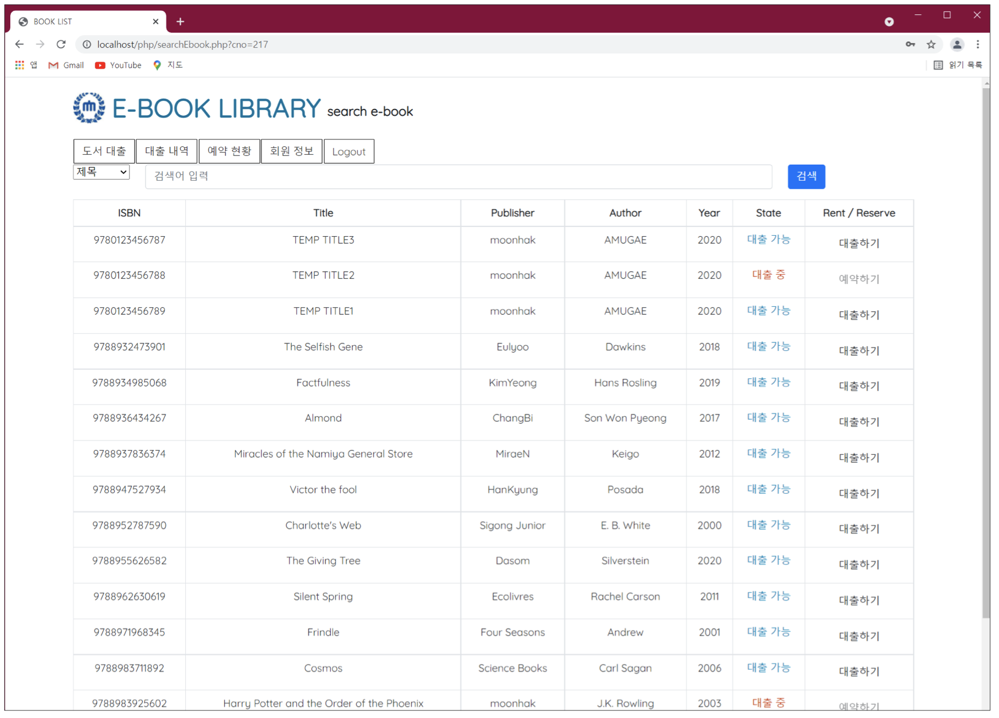

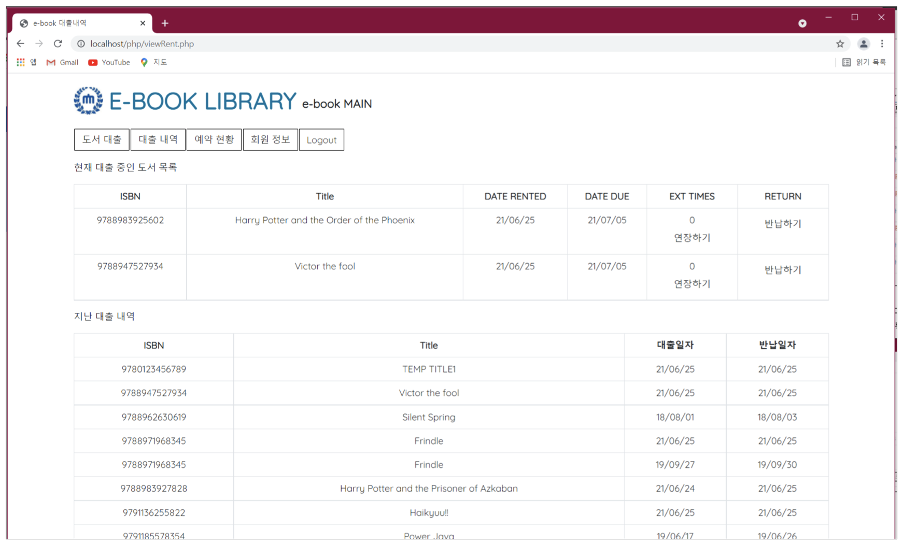
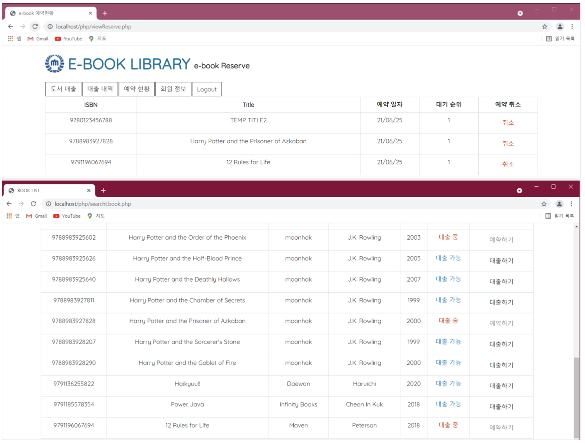
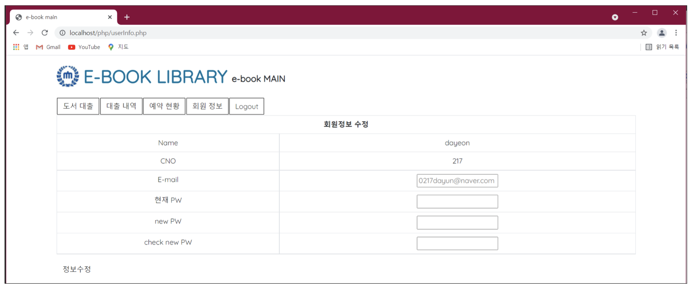

### 🔑 Admin
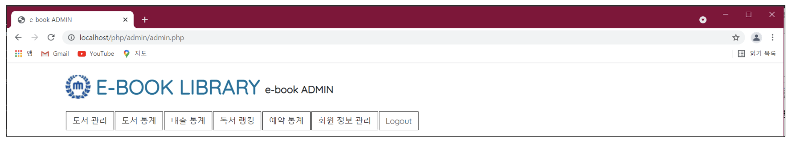

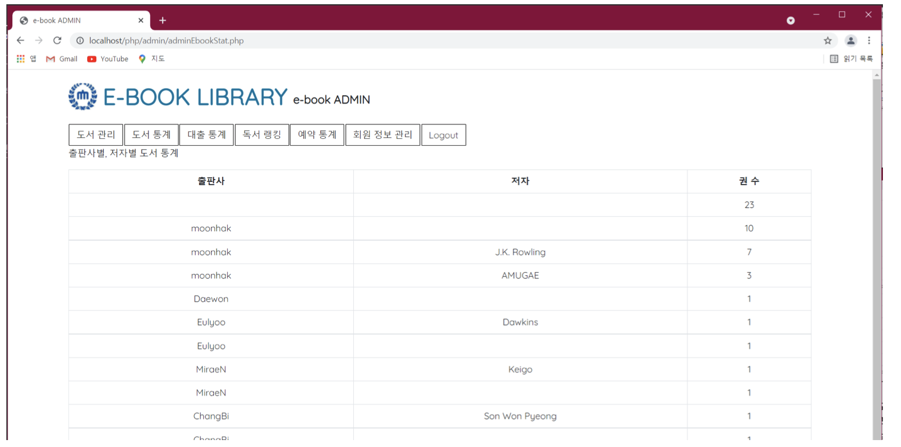
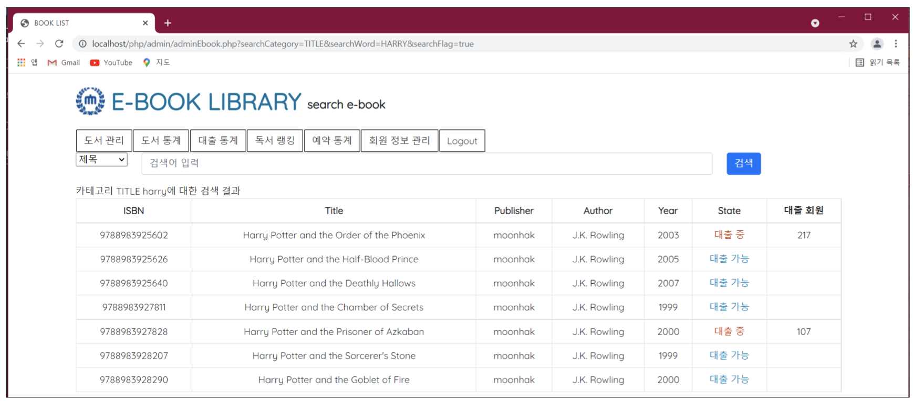
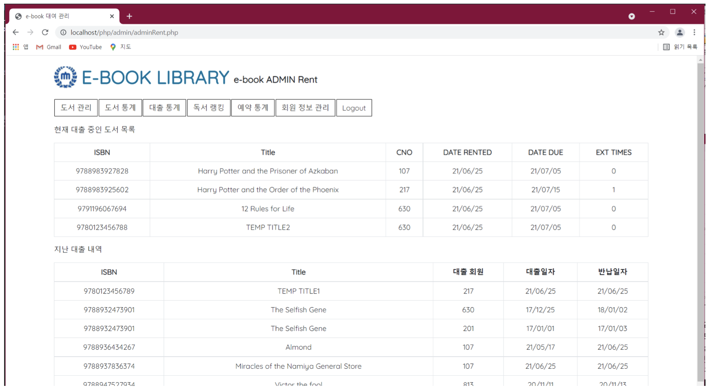
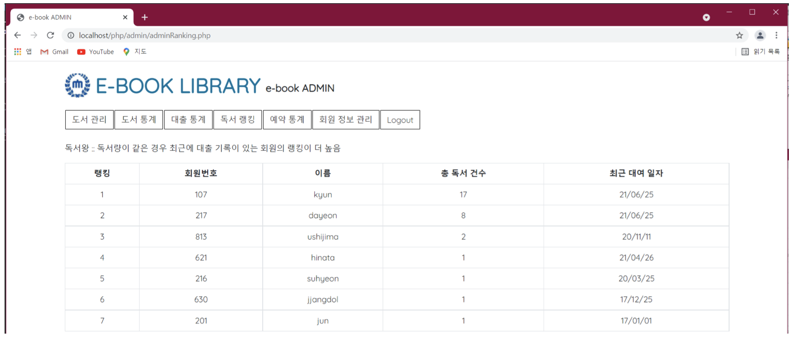
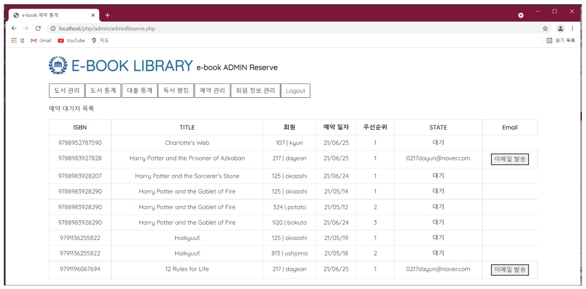
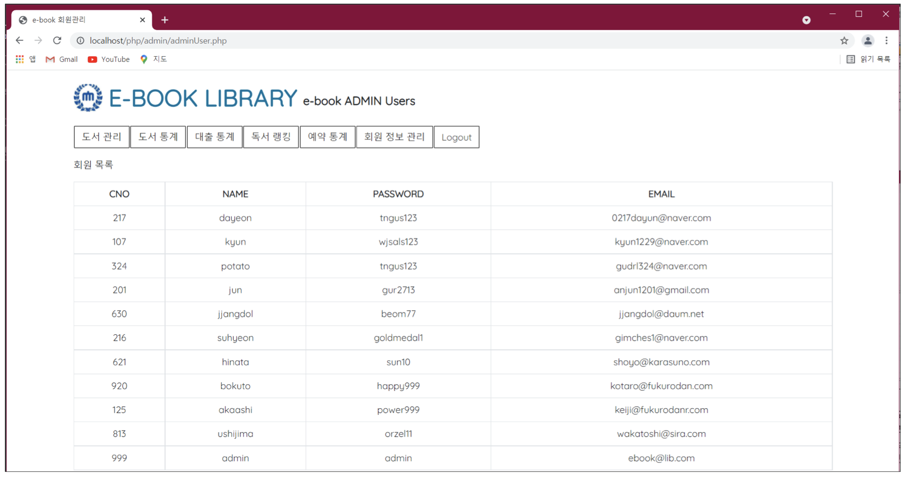

## 📌 Memo
- 예약 대기자에 예약 가능 메일 발송부분 구현 X
