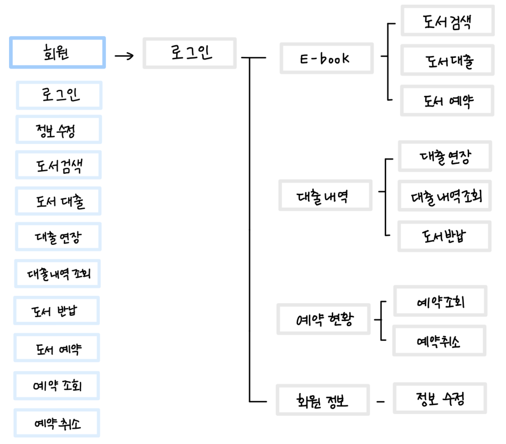
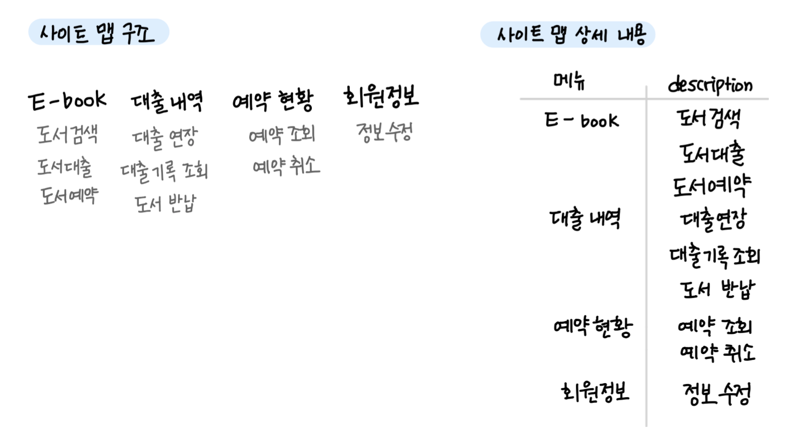
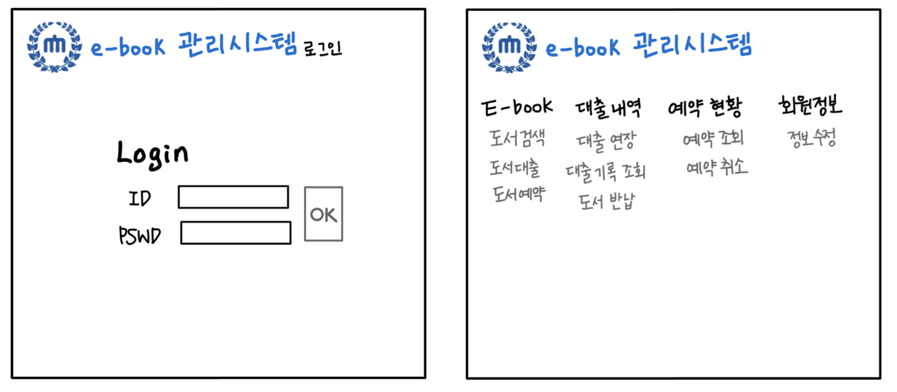
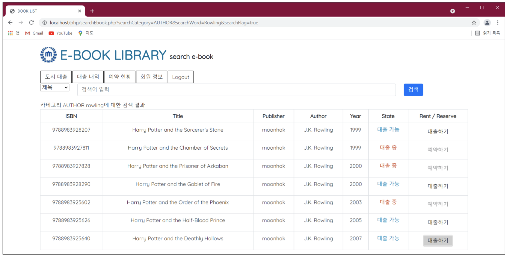

# Virtual_E-Library

## 📚 Summary
- 2021학년도 1학기 (5학기) 데이터베이스 과목 개인 텀프로젝트
- 가상 온라인 도서관 시스템
- 회원들은 웹을 이용해 직접 도서관의 e-book 도서를 검색, 대출, 예약, 반납 기능 이용 가능

## 🛠 Tech
- Oracle RDBMS, sql
- php
- IDE VSCode

## 📷 Design (UI 설계서)
[ 프로세스 정의서 ]

[ 사이트 맵 ]

[ 시스템 구조 ]

[ UI 설계서(01) :: 로그인, 메인 ]

[ UI 설계서(02) :: 도서검색, 대출기록 조회 ]

[ UI 설계서(03) :: 예약 관리, 정보 수정 ]

## 📸 ScreenShot
### 👥 User

로그인 화면

메인 / 도서목록

도서 검색

대출 기록

예약 기록

회원 정보 수정

### 🔑 Admin

관리자 카테고리

메인 / 도서 상태

도서에 대한 통계

도서 검색

대출 현황 및 기록

독서왕 랭킹

예약 현황

회원 목록

## 📌 Memo
- 예약 대기자에 예약 가능 메일 발송부분 구현 X
